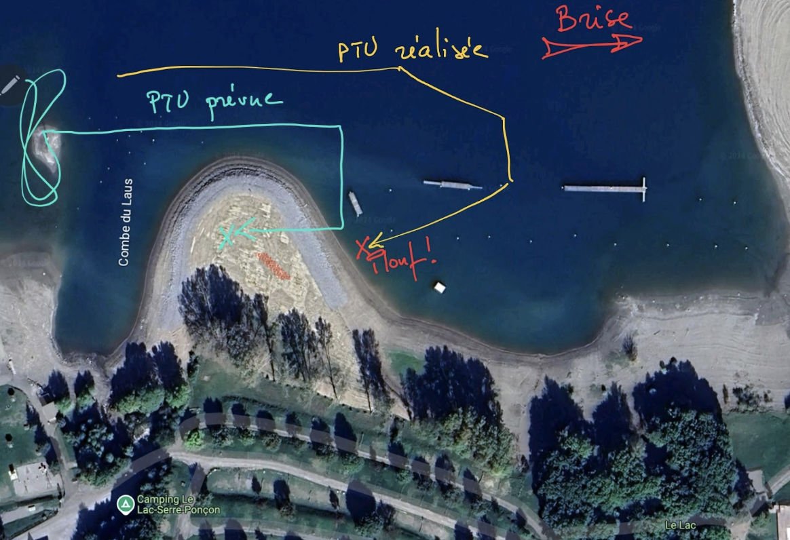

= Plouf à l'atterro de Saint-Vincent-Les-Forts
Jean-Michel Bruel <jbruel@gmail.com>
//v2024-09-16: Draft initial
:numbered:
:toc: left
:icons: font
:twoinches: width=144
// using a role requires adding a corresponding rule to the CSS
:full-width: role=full-width
:half-width: role=half-width
:half-size: role=half-size
:thumbnail: width=60
ifdef::backend-pdf[]
:twoinches: pdfwidth=2in
// NOTE use pdfwidth=100vw to make the image stretch edge to edge
:full-width: pdfwidth=100%
:half-width: pdf{half-width}
// NOTE scale is not yet supported by the PDF converter
:half-size: pdf{half-width}
:thumbnail: pdfwidth=20mm
endif::[]
ifdef::backend-docbook5[]
:twoinches: scaledwidth=2in
:full-width: scaledwidth=100%
:half-width: scaled{half-width}
:half-size: scale=50
:thumbnail: scaledwidth=20mm
endif::[]

== Le contexte

Aterrissage tranquilou après un décollage de Saint-Vincent-les-Forts où ça ne tient finalement pas.
Je suis le seul du groupe à sortir le chiffon ("toujours partant pour un plouf, on apprend toujours !").
Conditions très calmes et légère brise sur le lac de Serre Ponçon.

== Description de l'incident

Je décide de travailler la PTU (estimation de l'altitude à laquelle faire sa branche finale qui me pose parfois des soucis encore).

.PTU prévue vs PTU réalisée

Je fais ma perte d'altitude au vent du terrain lorsque j'apperçois un parapente en approche en face de moi (face à la brise, en PTS), mais plus bas.
Il met un temps infini à descendre (peut-être me laissait-il passer ?) si bien que je me retrouve à sa hauteur.

Je décide de me lancer sur mon plan initial de PTU, mais en allongeant mes branches pour passer derrière lui (je pense être assez haut).
Si bien que je me retrouve trop court et pose dans le lac (à 5m du bord, mais sans avoir pied).
Heureusement une nageuse me tire vers le bord car la brise emporte doucement ma voile vers le large.

Aucun dégât physique (je ne parle pas hélàs de mon Syride…) mais grosse frustration de devoir passer des heures à tout sécher et plier le secours le lendemain matin (merci les copains).
Et puis gros coup au moral en imaginant comment je vais bien me faire pourir par les copains (je suis Pélican31 maintenant ;-)

== Mon analyse

Comment diable ai-je pu être aussi mauvais ?
Le pilote d'en face n'y est absolument pour rien, ses gestes et intentions étaient claires et saines.
Je me suis juste précipité.

Je pense que j'ai été victime de ce fameux "effet tunnel" tant décrit dans les incidents.
J'avais décidé de poser d'une certaine façon, et à un certain endroit, et je m'y suis tenu coûte que coûte, alors que j'avais (a posteriori) plein d'options (tourner devant lui pour poser sur la plage suivante, très saine, ou encore couper pour viser le bord de lac).

Quelques autres remarques :

- Peut-être un peu ambitieux, la PTU, sur un si petit atterro (mais après tout je vise à valider le BPC, faut assumer).
- Je n'avais pas réfléchi à un plan B ou en tout cas analysé toutes les options pour atterir, alors qu'y avoir ne serait-ce que pensé, m'aurait peut-être permi de les mettre en oeuvre dans l'urgence.
- Je n'avais pas anticipé à quel point j'allai plonger une fois au bord de la plage (je me suis finalement retrouvé sous le vent de la plage).

== Ce que j'ai retenu

- Que s'est bien d'analyser tous les posés possibles pendant sa perte d'altitude tranquille.
- Qu'un atterrissage prévu n'est pas immuable et que la sécurité doit primer sur les priorités ou la politesse.
- Que par beau temps ça sèche vite un parapente et un secours, mais que les suspentes et les selettes mettent plus longtemps.
- Que la solidarité entre parapentistes joue à fond dans ces grands moments de solitude.
- Que les copains sont pas si moqueurs après tout, car ils ont bien vu que j'avais les boules.

:numbered!:
== Note

WARNING: N'hésitez pas à partager pour que ça serve au plus grand nombre.

(Version en anglais: link:retex-serreponcon2024-en.html[ici])
