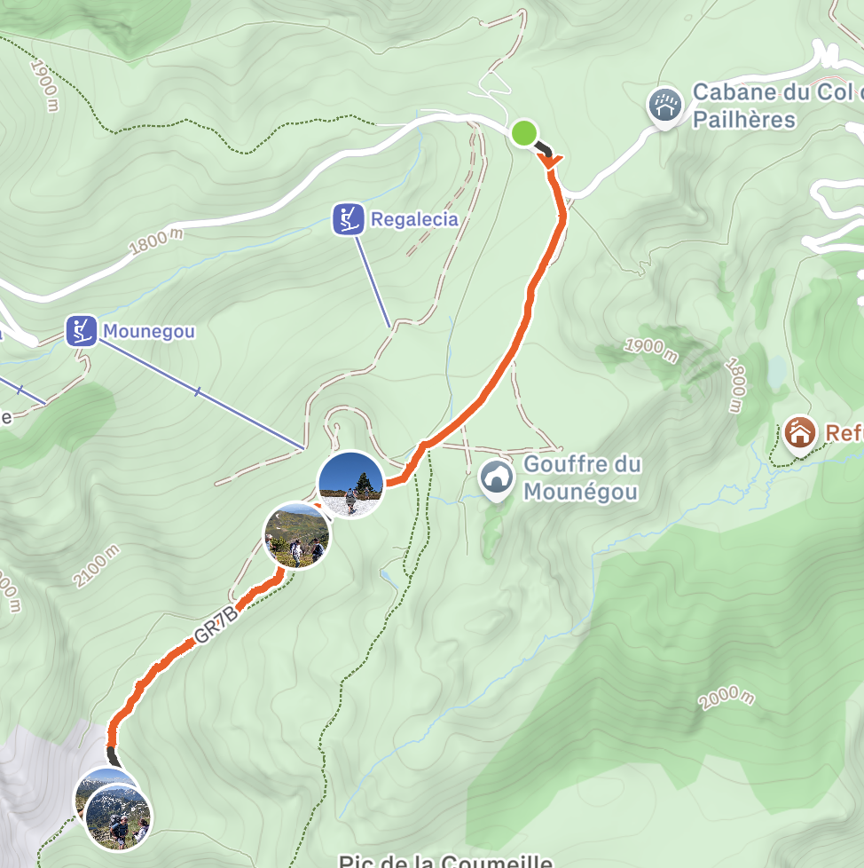
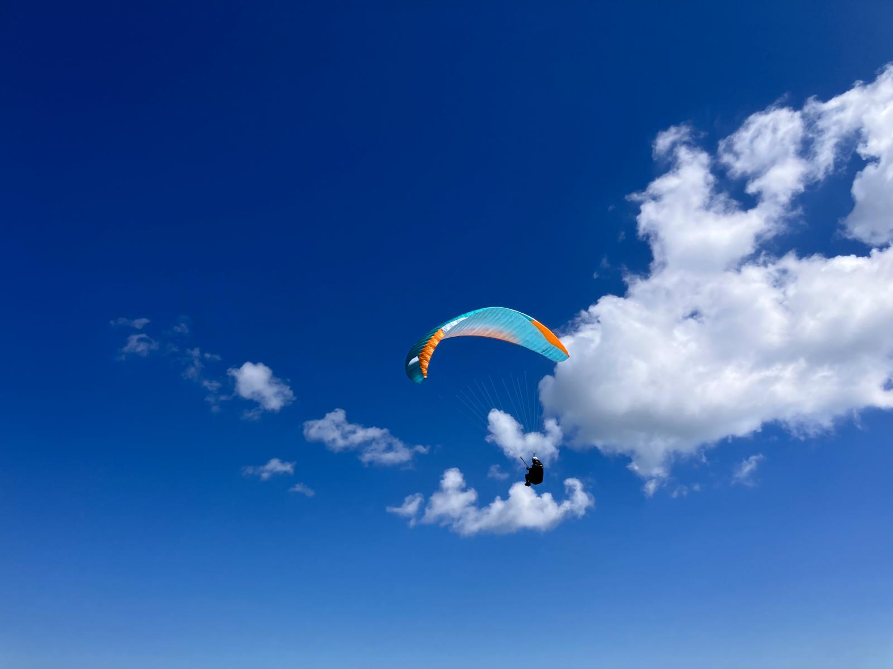
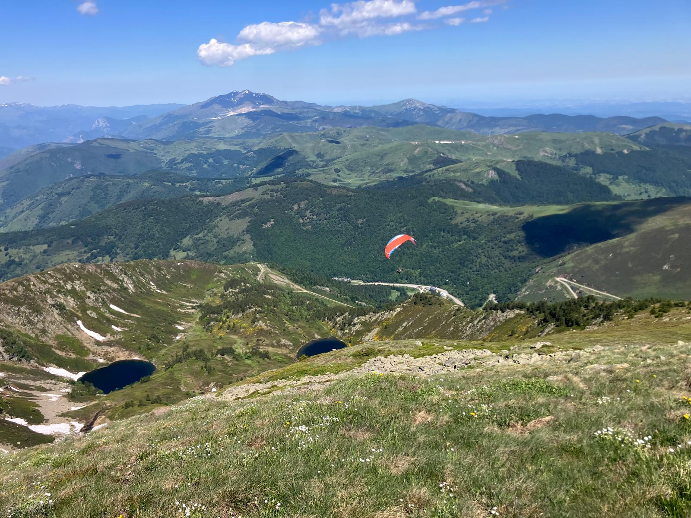
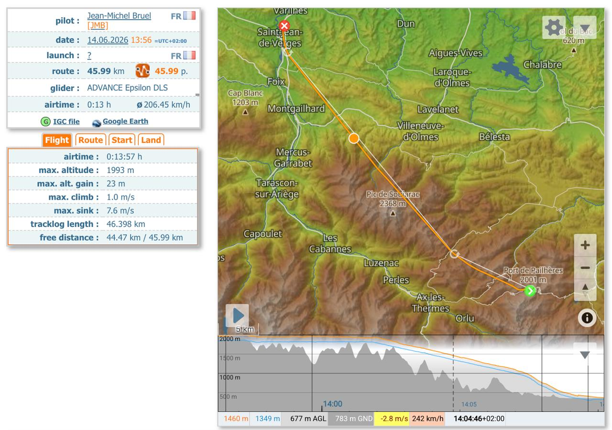
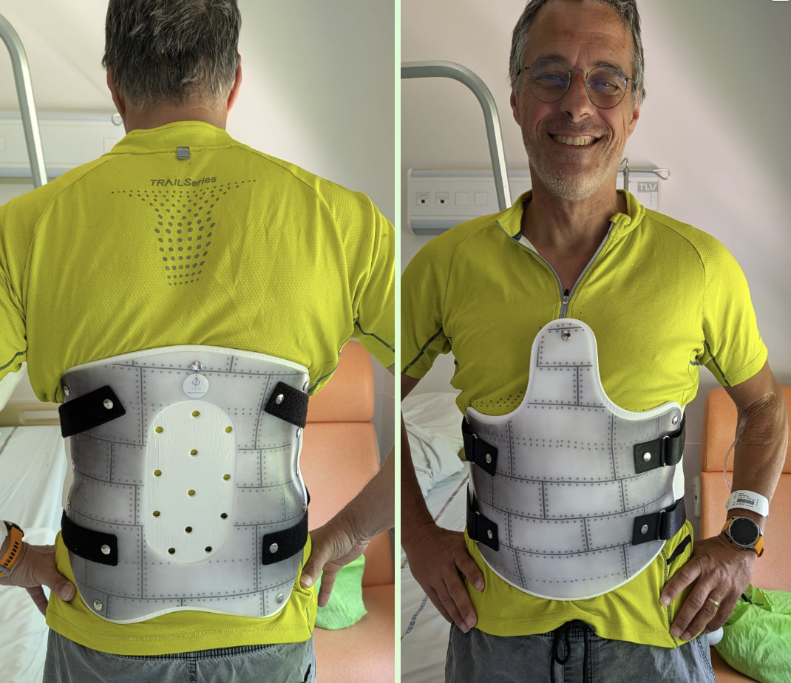

= Prudence au gonflage !
Jean-Michel Bruel <jbruel@gmail.com>
v2026-06-19: 
:numbered:
:toc: auto
:icons: font
:twoinches: width=144
// using a role requires adding a corresponding rule to the CSS
:full-width: role=full-width
:half-width: role=half-width
:half-size: role=half-size
:thumbnail: width=60
ifdef::backend-pdf[]
:twoinches: pdfwidth=2in
// NOTE use pdfwidth=100vw to make the image stretch edge to edge
:full-width: pdfwidth=100%
:half-width: pdf{half-width}
// NOTE scale is not yet supported by the PDF converter
:half-size: pdf{half-width}
:thumbnail: pdfwidth=20mm
endif::[]
ifdef::backend-docbook5[]
:twoinches: scaledwidth=2in
:full-width: scaledwidth=100%
:half-width: scaled{half-width}
:half-size: scale=50
:thumbnail: scaledwidth=20mm
endif::[]

== Le contexte

=== Le Tarbésou

Nous sommes partis avec Freddy pour faire un marche & vol au Tarbésou (2364m) avec l'objectif d'y décoller.
Départ du parking au Col de Pailhères avec nos petites femmes, où nous laissons la voiture. 
Après 1h10 de marche, nous atteignions tranquillement le sommet. 

.Hike & Fly: part 1

Le vent est relativement faible, ce qui n'est pas souvent le cas au Tarbésou (<15km/h) et orienté NO comme prévu.
Par contre les thermiques côté SE, commencent à faire bourgeonner des petits cums (cf. photos).

.Les 1er cums

Nous descendons un peu du sommet pour trouver des replats propices à nous envoler.
Comme anticipé, la masse d'air est assez instable à cause de la convergence du vent météo, plutôt NO et des thermiques derrière nous au SE. 
Nous avions convenu de rester dans le dynamique du nord-ouest en évitant de nous confronter aux thermiques en nous disant que s'ils arrivaient à contrer le vent météo, même faible, c'est qu'ils étaient relativement puissants.

=== Le décollage

Bref, après quelques hésitations au décollage à cause des turbulences, nous trouvons une façon efficace de décoller : entre deux cycles pour Freddy, et en descendant un peu plus bas pour moi (cf. vidéo ci-dessous, prise par nos chéries).

.Turbulences au décollage
video::turbulences.mp4[{half-width}, "Turbulences au décollage"]

.Décollage Freddy
video::decoFreddy.mp4[{half-width}, "Décollage de Freddy"]

.Décollage JMB
video::decoJMB.mp4[{half-width}, "Décollage de moi"]

=== Le vol

Nous jouons une quinzaine de minutes en soaring côté NO.

.Le Tarbésou en dynamique
video::soaring.mp4[{half-width}, "Soaring côté NO"]

Comme nous en avions convenus ensemble, si l'un de nous ne le sentait pas on avait décidé d'aller atterrir tranquillement au col de Pailhères, qui est un grand plat qui, même pour un col (c'est-à-dire avec du venturi) ne posait pas de problème avec ce vent météo faible (<15km/h).

.Vol en dynamique côté NO

WARNING: Premier signe qui aurait dû nous alerter : j'arrive à peine à descendre pour atterrir. 

Je révise même les oreilles pour arriver à descendre. 
Je pose néanmoins sans aucun problème pour rejoindre Freddy qui m'avait indiqué, par son atterrissage, l'orientation du vent.

WARNING: Deuxième signe qui aurait dû nous alerter : le vent est complètement Nord, c'est à dire d'aucune des 2 vallées qui montent au col, mais bien dans l'axe Nord-Sud de la crête qui monte au Tarbesou ?!

=== Le gonflage post-vol

Ayant largement le temps d'attendre les filles, nous commençons à faire du gonflage tranquillement. 
Le vent est faible, toujours orienté Nord c'est-à-dire ni de la vallée d'Ax qui vient plutôt de l'Ouest, ni de la vallée de Mijanès qui vient plutôt du SE.

WARNING: Troisième signe qui aurait dû nous alerter : il fait très chaud (on est vers midi).

Au point que je commet l'erreur d'enlever et mes gants, et ma veste, et d'**enlever mon casque** !!
Le vent est tellement faible qu'on cherche le venturi pour arriver à soulever nos voiles au-dessus de nos têtes. 

Dernier souvenir avant mon incident : je suis face à ma voile, un doigt sur chaque suspente de freins, tête baissée pour gonfler aux sensations.

=== L'incident

Le souvenir suivant : je suis assis par terre, entouré de personnes que je ne connais pas, et je vois mon Freddy au téléphone avec ce qui semble être les secours. 
Même s'il essaie de le cacher, il semble inquiet. Quelque chose de pas normal a dû se passer.

Il me racontera plus tard que j'ai été 30 secondes sans connaissance, et que pendant les premières minutes où j'ai récupéré mes esprits, j'étais incohérent. 
Mes souvenirs ne reprennent qu'à partir du moment où je suis cohérent, c'est-à-dire que je comprends que j'ai pris un bon vrac, qui m'a bien mâché le dos. 
Je demande à être relevé, car je pense que tout va bien, un peu comme après une chute à vélo. 
Bien sûr, Freddy m'interdit de bouger. 
Les gens sont très gentils, me font de l'ombre et les pompiers arrivent très vite d'Ax. 
Il me prennent en charge rapidement, me font les premiers checks, me mettent sur coquille et m'annoncent qu'un hélicoptère étant dans les parages, je vais pouvoir en bénéficier. 
C'est top parce que j'ai évité tous les virages de la descente et je suis arrivé très vite aux urgences du CHIVAS, (l'hôpital de Foix).

.Evacuation en hélicoptère (trace capturée par XCTrack!!)

=== Les soins

Là, on me fait rapidement des examens type échographie et on m'annonce un scanner pour 17h (car un scanner se fait quatre heures après un choc, car s'il est fait trop tôt, il peut passer à côté d'hémorragies ou de phénomènes plus graves).

Le scanner complet, du tronc et du crâne révèle que tout est normal, sauf ma vertèbre TH12 qui s'est tassée apparemment au moment de l'impact. 
Je dois donc rester immobilisé allongé sur le dos jusqu'à la fabrication sur mesure d'un corset qui me permettra de me lever. 
Corset dont les mesures seront prises le lundi, qui me sera livré le mardi pour un retour à domicile en ambulance le mardi soir.

.Prêt à enfin quitter les urgences

Très belle efficacité et gentillesse du personnel du CHIVAS (bon, même s'ils ont égaré mes godasses au passage).

== Analyse et leçons à retenir

=== Ce qui a dû se passer

Vu comment je suis courbatu au niveau des cervicales, et vu les marques sur mon visage, on en déduit que je suis tombé la tête la première.
D'où les marques au visage, le mal au cou et le tassement des vertèbres qui est plus important qu'il ne l'aurait été si j'étais tombé sur les fesses 
(avec le moussebag de ma selette quasi neuve). 

Freddy m'a vu monter en l'air à 3 ou 4m et retomber. 
Il s'agit donc soit d'un dust soit d'un très fort coup de vent. 
J'ai dû commettre l'erreur par réflexe d'appuyer sur les suspentes de frein pour me retenir et très certainement décrocher.

=== Ce que nous aurions dû éviter

Avec du recul, cette grande étendue plate, en plein soleil, avec un parking à proximité et la route du col, est très certainement très propice aux déclenchements de thermiques a minima. 
Nous n'aurions donc pas dû nous y amuser à cette heure-là.

Bien sûr, ma principale erreur, même si elle n'aurait pas épargné ma vertèbre, a été d'enlever mon casque qui m'aurait très certainement protégé au moins du trauma crânien qui a, non seulement inquiété tout le monde, mais m'a empêché de me souvenir de ce qui s'est passé.

=== À retenir pour l'avenir

Pour moi, les leçons à retenir de cet épisode sont :

- **Toujours garder son casque**, même si on a chaud, et même si le gonflage paraît facile.
- Attention quand on fait du **gonflage aux heures chaudes**.
- Attention quand on fait du **gonflage sur un col** avec des vents qui peuvent être contraires.

:numbered!:
== Remerciements

Merci à tous ceux qui m'ont aidé, et notamment à Freddy pour sa présence et son sang-froid, aux pompiers d'Ax pour leur efficacité, et au personnel du CHIVAS pour leur gentillesse et leur professionnalisme.

Merci aussi à tous ceux qui m'ont envoyé des messages de soutien et qui m'ont aidé à me rappeler que j'aurai pu perdre bien plus que la formation QBi que je vais rater à cause de cette mésaventure.

Et merci à vous de m'avoir lu. Désolé pour la longueur.
Je suis preneur d'avis et d'opinions sur ce Retex, afin qu'il se serve à un maximum de monde pour éviter si possible que cette mésaventure arrive à d'autres.
